# IoT Cloud-Based System with Raspberry Pi 5 and Sense HAT

## Introduction

This project focuses on developing a robust Internet of Things (IoT) system leveraging the capabilities of Raspberry Pi 5 and Sense HAT, integrated with third-party cloud brokers. The core problem addressed is the efficient collection, transmission, and visualization of environmental sensor data in a cloud-based environment. By utilizing the MQTT communication protocol and Platform as a Service (PaaS) solutions, the system enables seamless data flow from a publisher (Raspberry Pi with Sense HAT) to cloud brokers, and finally to a client (subscriber) for real-time monitoring and informed decision-making.

The system captures critical environmental parameters such as barometric pressure, temperature, magnetometer readings, and humidity. This data is then transmitted to a cloud broker, which handles storage, topic management, payload processing, and Quality of Service (QoS) levels (0, 1, or 2). While the publisher continuously streams sensor information, the subscriber receives notifications of subscribed topics and payloads, complemented by data visualizations for comprehensive analysis.

## Requirements

### Hardware
*   Raspberry Pi 5
*   Raspberry Pi Sense HAT

### Software
*   Raspberry Pi OS (imager_1.8.5)
*   Python 3.x
*   VNC Viewer
*   Visual Studio Code on Raspberry PI OS

### Cloud Broker Service Platforms
*   Adafruit IO (Free version)
*   EMQX (Free version) (broker.emqx.io)

### Network
*   MQTT TCP Port: 1883

## Prerequisites & Installation

Before you begin, ensure your Raspberry Pi is set up with the necessary libraries and software.

### Initial Setup

1.  **Load Raspberry Pi OS:**
    *   Use Raspberry Pi Imager (imager_1.8.5) to flash the Raspberry Pi 5 OS onto your microSD card.
    *   Configure and restart both Raspberry Pi and your computer.
2.  **Raspberry Pi 5 Configuration:**
    *   After connecting HDMI and power, set up the Raspberry Pi 5:
        *   Select New Zealand as the country and UK English as the language.
        *   Configure with username "takashi" and password "3ua3062m".
        *   Set up Wi-Fi using your home router credentials.
        *   Choose Chrome as the browser.
        *   Allow remote access for the security system.
        *   Update the computer and reboot both Raspberry Pi 5 and your home PC.
3.  **Attach Sense HAT:**
    *   Ensure proper spacing between the Raspberry Pi 5 and Sense HAT. If the Raspberry Pi 5 is already running, shut it down before attaching the Sense HAT, then power it back on.

### Library Installation

Open a terminal on your Raspberry Pi and execute the following commands:

1.  **Update and Upgrade System:**
    ```bash
    sudo apt-get update
    sudo apt-get upgrade
    ```
2.  **Install Sense HAT Library:**
    ```bash
    sudo apt-get install sense-hat
    ```
    *   Python import: `from sense_hat import SenseHat`
3.  **Install Paho MQTT Library:**
    ```bash
    pip3 install paho-mqtt --break-system-packages
    ```
    *   Expected outcome: `Successfully installed paho-mqtt-2.1.0`
    *   Python import: `import paho.mqtt.client as mqtt`
4.  **Install Visual Studio Code:**
    ```bash
    sudo apt update
    sudo apt install code
    ```

### Cloud MQTT Broker Setup

*   **For Tasks 2-3 (EMQX):** The broker address `broker.emqx.io` is used, with port `1883`. For local testing, `127.0.0.1` can be used. When connecting to `broker.emqx.io`, modify the unique parameter name (e.g., "takashi/humidity"). Obtain your local IPv4 address by typing `ifconfig` in the terminal.
*   **For Task 4 (Adafruit IO):** Register for an account and create four feeds: "pressure," "temperature," "magnetometer," and "humidity." Note your API key (username and active key for Circuit Python). You can create custom dashboards with various display options (gauges, line charts, texts, streams).

### Real VNC Viewer Setup

1.  **Enable VNC on Raspberry Pi:**
    *   Go to `Preferences -> Raspberry Pi Configuration -> Interfaces`.
    *   Enable SSH, Raspberry Pi Connect, and VNC. Click `OK`.
    *   Alternatively, in the terminal, type `sudo raspi-config`, select option `#33 Interface options`, then choose `VNC` and answer "Yes" to enable the VNC server.
2.  **Find Raspberry Pi's IP Address:**
    *   In the terminal, type `ifconfig` to find the IPv4 address (e.g., `192.168.1.65`). Record it.
3.  **Restart:** Restart the Raspberry Pi server and your computer.
4.  **Download VNC Viewer:** Download the Real VNC Viewer on your laptop.
5.  **Sign In/Register:** Sign in or register for a VNC account.
6.  **Connect:** Enter the Raspberry Pi's IPv4 address (e.g., `192.168.1.65`) in the VNC Viewer.
7.  **Authenticate:** Enter the Raspberry Pi username (`Takashi`) and password (`3ua3062m`).
8.  **Remote Control:** After removing the HDMI cable, you can control the Raspberry Pi screen remotely.

## Tasks Overview

This project is structured into four main tasks, each building upon the previous one to demonstrate a comprehensive IoT system.

### Task 1: Display Sensor Information

*   **Objective:** Read environmental sensor data from the Sense HAT and display it on both the computer terminal and the Sense HAT's LED matrix.
*   **Sensor Information:** Barometric pressure, Temperature, Magnetometer, Humidity.
*   **High-Level Demo:** A Python script continuously reads sensor values. These values are then printed to the console and scrolled across the Sense HAT's LED display, with different colors indicating different sensor types (e.g., green for pressure, blue for humidity, red for temperature, orange for magnetometer).
*   **Expected Outcome:** Sensor data is displayed on both the computer screen and the Sense HAT LED screen using digital pixel values (0-255) for red, green, blue, and yellow.

    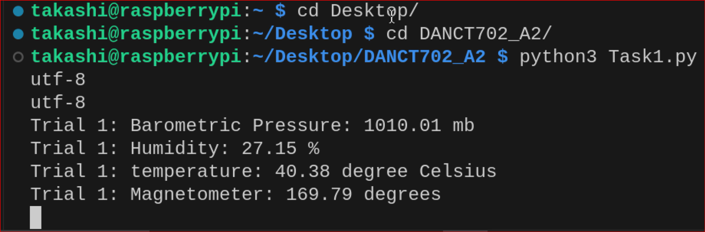

    *(Refer to `Task1/Task1_Sense_HAT_LED_result.mp4` for LED display demonstration)*

### Task 2: Create MQTT Client to Publish Data

*   **Objective:** Extend the system to publish Sense HAT sensor data to an MQTT broker using a Python script, with a sample rate of 1 second.
*   **Sensor Information:** Barometric pressure, Temperature, Magnetometer, Humidity.
*   **High-Level Demo:**
    *   `Task2.py`: A Python script connects to an MQTT broker (e.g., EMQX), reads sensor data, and publishes it as JSON messages to distinct MQTT topics (e.g., `home/sensors/pressure`). The data is also printed to the command terminal.
    *   `Task2.1.py`: This script provides real-time data visualization using `matplotlib`, plotting the sensor data as it's read.
*   **Expected Outcome:** Sensor data is published to the MQTT broker (EMQX) at a 1-second rate, displayed in the command terminal, and visualized graphically using Python's `matplotlib` library.

    **Terminal Output (mqtt_publisher.py):**
    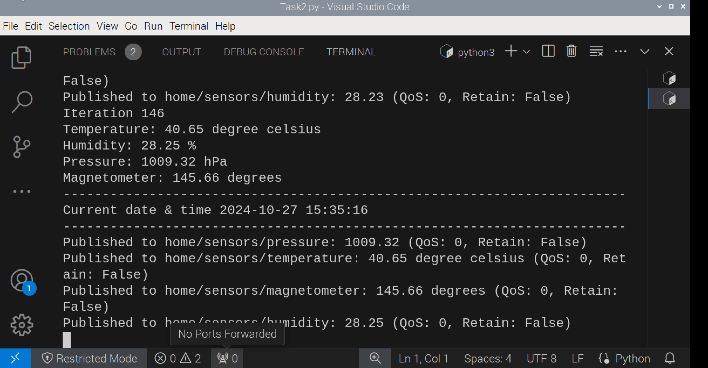
    *(Refer to `Task2/Task2.command_terminal_result_1.mp4` for video demonstration)*

    **Real-time Plot (mqtt_publisher_plotter.py):**
    *(Refer to `Task2/Task2.1_command_terminal_Result_Data_Visualisation_Plot..mp4` for video demonstration)*

### Task 3: Create MQTT Client to Subscribe to Topics

*   **Objective:** Develop an MQTT client on the Raspberry Pi that subscribes to the topics published in Task 2. This task introduces interactive control via the Sense HAT joystick and data logging to CSV files.
*   **Requirements:**
    1.  **Joystick Control:** Use the joystick buttons to change the subscribed MQTT topic. Pressing `Up` subscribes to Temperature, `Down` to Pressure, `Left` to Humidity, and `Right` to Magnetometer. The new topic information is displayed on the screen.
    2.  **CSV Data Storage:** All received data is stored in separate CSV files (e.g., `Barometric pressure.csv`, `Temperature.csv`, `Humidity.csv`, `Magnetometer.csv`) in UTF8 format.
    3.  **Unsubscribe:** Pressing the `Middle` joystick button unsubscribes from all topics, terminating data reception and CSV logging. Data logging can be resumed by selecting a new topic with the joystick.
*   **High-Level Demo:** The user interacts with the Sense HAT joystick to dynamically subscribe to different sensor data streams. As data is received, it's logged to specific CSV files, providing a historical record of sensor readings.
*   **Expected Outcome:** Only data from the topic subscribed via the joystick is displayed on the screen and logged to a corresponding CSV file every second. Changing joystick direction creates new CSV files for the newly subscribed topic. Received data is stored in `.csv` files with appropriate naming conventions.

    **Video Demonstrations:**
    *   LED Live Demo: *(Refer to `Task3/Task3_LED_Livedemo_part2.mp4`)*
    *   Recorded Demonstration (LED & Terminal Result with CSV): *(Refer to `Task3/Task3_recorded_demonstration_LED_Terminal_result_CSV..mp4`)*

    **CSV Files Generated:**
    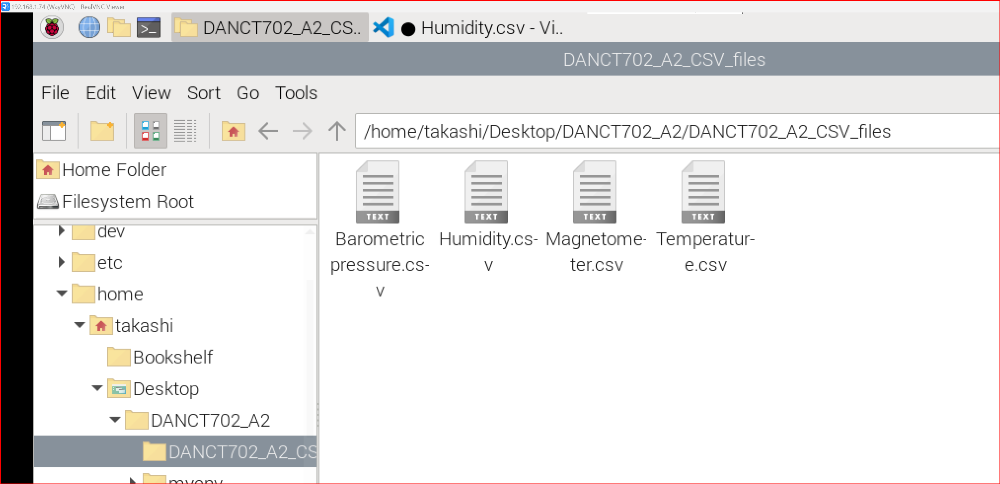

    **Terminal Output Examples (CSV Logging):**
    *   Barometric Pressure:
        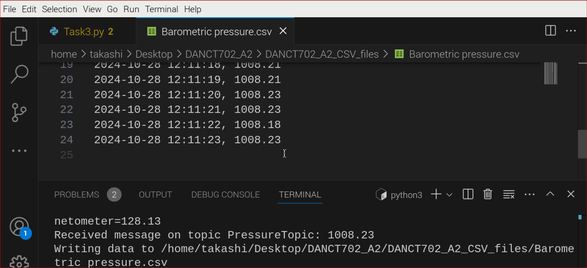
    *   Humidity:
        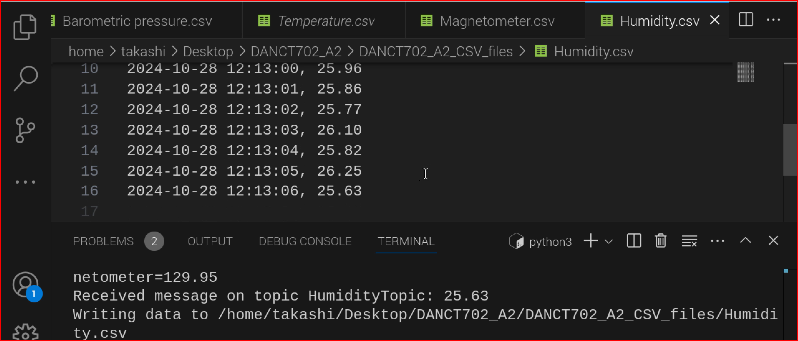
    *   Magnetometer:
        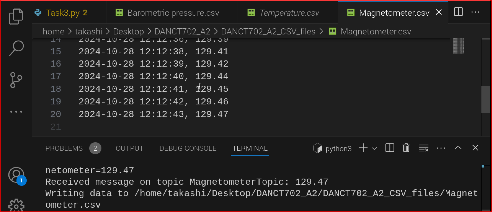
    *   Temperature:
        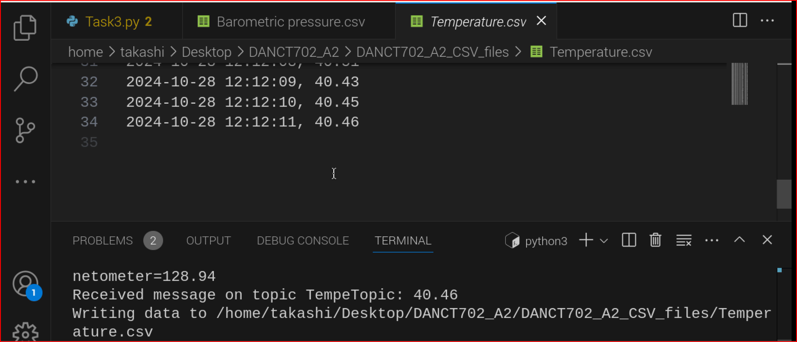

    **Joystick Unsubscribe Example:**
    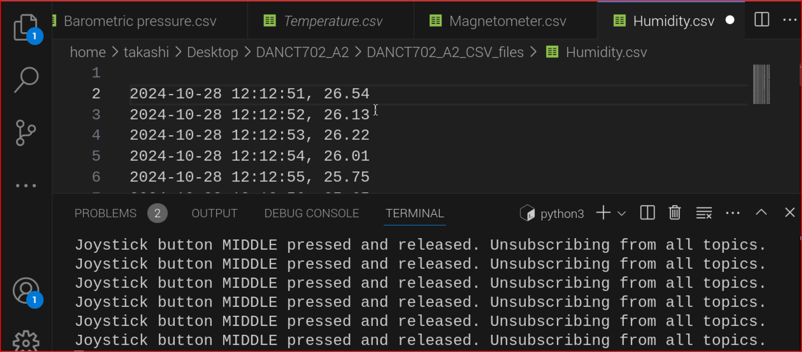

### Task 4: Create and Manage Cloud System

*   **Objective:** Establish and manage a cloud-based system (using Adafruit IO) for handling IoT data, including publishing, subscribing, and dashboard visualization.
*   **Requirements:**
    1.  **Cloud MQTT Broker Registration:** Register with a cloud MQTT broker service (e.g., Adafruit IO) and create four feeds: "pressure," "temperature," "humidity," and "magnetometer."
    2.  **Connect Raspberry Pi:** Connect the Raspberry Pi (acting as an MQTT publishing client) to the cloud broker. The broker's dashboard should display the published data.
    3.  **Live Data Plots:** Create a live plot on the broker dashboard for each parameter, resulting in four distinct dashboards.
    4.  **Dashboard Customization:** Customize the dashboard with various widgets like gauges, line charts, texts, and streams.
    5.  **Cloud-to-Pi Subscription:** The Raspberry Pi should also be able to receive sample data from the cloud broker in subscribe mode after it has been published.
*   **High-Level Demo:**
    *   `Task4.1.py`: The Raspberry Pi continuously publishes sensor data to Adafruit IO feeds.
    *   `Task4.2.py`: The Raspberry Pi subscribes to these Adafruit IO feeds, fetches the data, and displays it on the Sense HAT's LED matrix.
    *   Simultaneously, the Adafruit IO dashboard provides real-time visualizations of the sensor data through live plots and other customizable widgets.
*   **Expected Outcome:** The Raspberry Pi successfully connects to the cloud MQTT broker and performs both publishing and subscribing. The broker dashboard displays live plots of sensor data. The Raspberry Pi receives and displays sample data published from the cloud broker.

    **Video Demonstrations:**
    *   Live Video Part 2: *(Refer to `Task4.1/Task4.1_4.2_livevideo_part2.mp4`)*
    *   Live Video Part 2 (Second Part): *(Refer to `Task4.2/Task4.1_4.2.livevideo_part2_2.mp4`)*

    **Command Terminal Output:**
    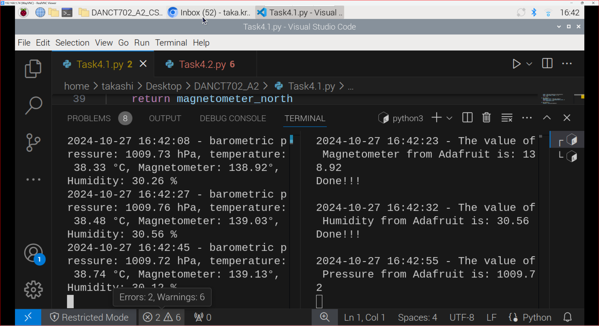

    **Adafruit IO Sensor Dashboards:**
    *   Barometric Pressure:
        
    *   Humidity:
        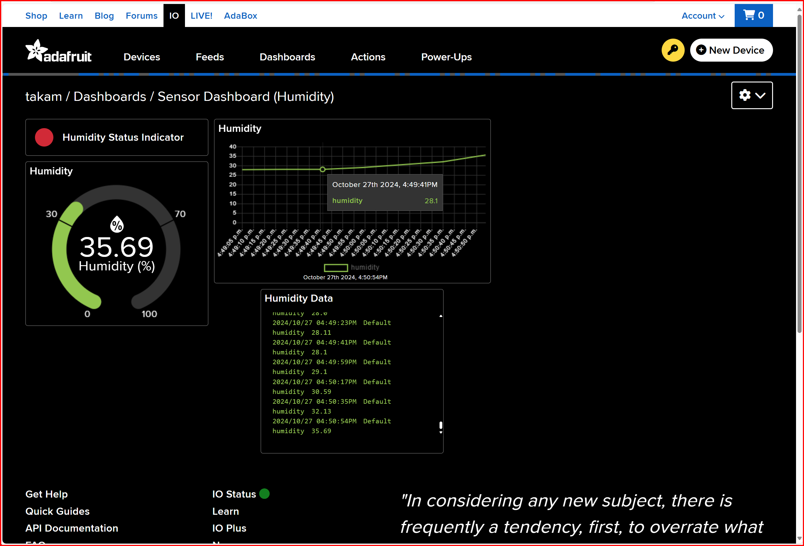
    *   Magnetometer:
        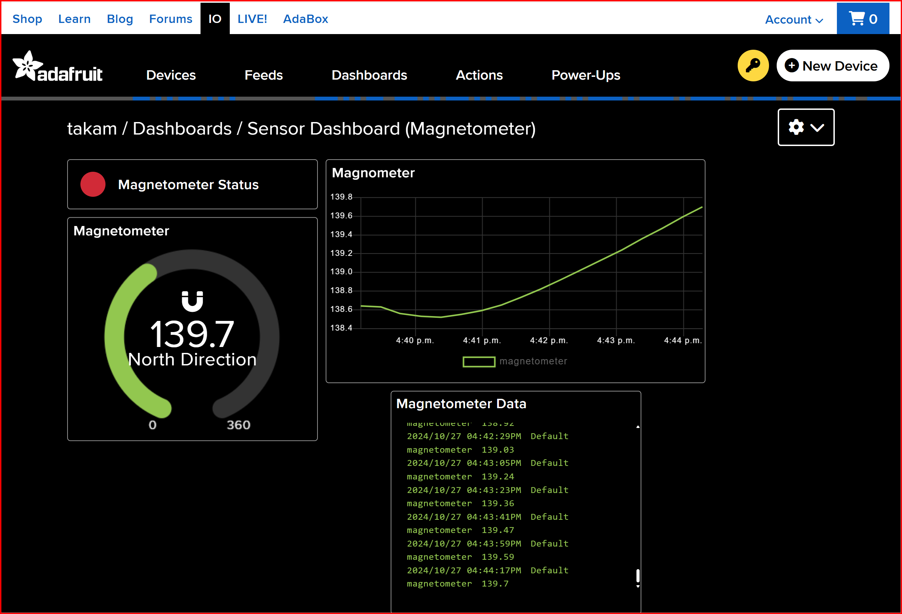
    *   Temperature:
        

    **Adafruit IO Plot Examples:**
    *   Humidity Plot:
        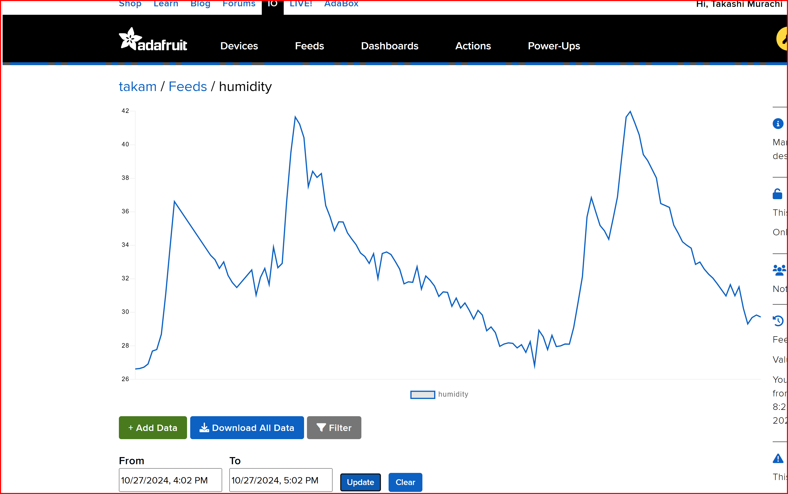
    *   Magnetometer Plot:
        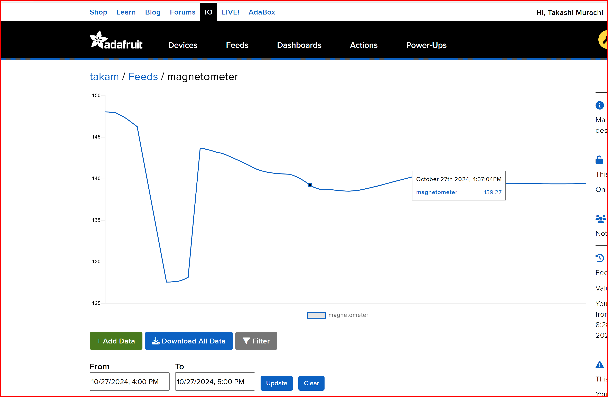
    *   Pressure Plot:
        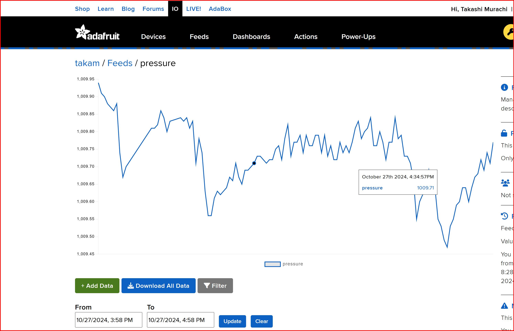
    *   Temperature Plot:
        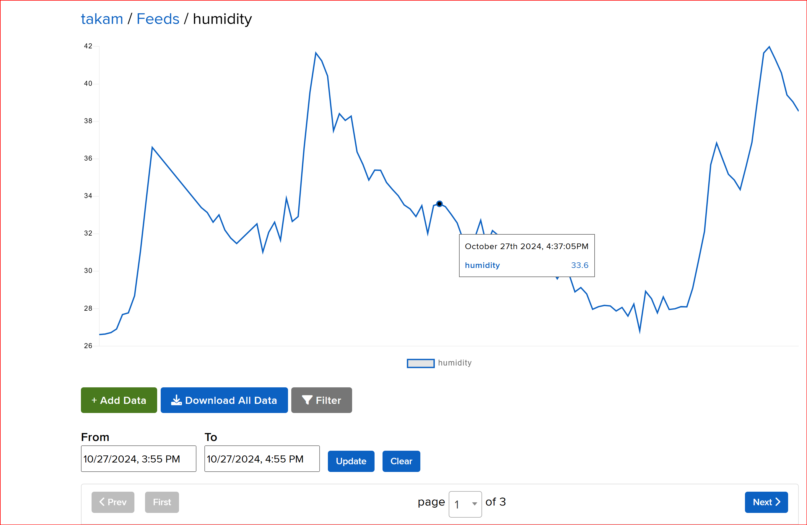

## Key Learning Points

*   **IoT System Design:** Gained practical experience in designing and developing a cloud-based IoT application from hardware integration to cloud deployment.
*   **Raspberry Pi & Sense HAT:** Learned to interface with Raspberry Pi 5 and utilize the Sense HAT's environmental sensors for data acquisition.
*   **MQTT Protocol:** Understood and implemented the MQTT communication protocol for efficient, lightweight messaging between IoT devices and cloud brokers, including QoS levels.
*   **Cloud Platform Integration:** Integrated with cloud-based MQTT brokers (EMQX, Adafruit IO) for data storage, management, and visualization.
*   **Data Visualization:** Developed skills in real-time data plotting using `matplotlib` and configuring cloud dashboards for effective data representation.
*   **Interactive Control:** Implemented interactive control mechanisms using the Sense HAT joystick for dynamic topic subscription.
*   **Data Persistence:** Learned to log sensor data to CSV files for historical analysis and record-keeping.
*   **Python Programming:** Enhanced Python scripting skills for IoT applications, including handling sensor data, MQTT client development, and file I/O.
*   **Remote Access:** Mastered the setup and use of VNC Viewer for remote access and control of the Raspberry Pi.
*   **Unique Identifiers:** Understood the importance of unique parameter names for sensor data when publishing to shared brokers.
*   **Data Formatting:** Gained experience in formatting sensor data (e.g., two-digit float numbers) for consistent display across terminals and cloud platforms.

## Challenges

*   **Network Connectivity and Stability:** Ensuring consistent and reliable network connectivity for the Raspberry Pi, especially when interacting with remote cloud brokers.
*   **MQTT Broker Configuration:** Correctly configuring MQTT brokers (EMQX, Adafruit IO) with appropriate topics, authentication, and understanding QoS levels.
*   **Real-time Data Synchronization:** Managing the delay between data publishing and subscribing, particularly when displaying data on the Sense HAT LED matrix, to ensure near real-time updates.
*   **Resource Management on Raspberry Pi:** Optimizing Python scripts for efficient use of Raspberry Pi's limited processing power and memory, especially with continuous sensor readings and network operations.
*   **Troubleshooting Sensor Readings:** Debugging potential issues with Sense HAT sensor readings or calibration.
*   **Adafruit IO API Integration:** Correctly using the Adafruit IO client library for publishing and subscribing, and understanding feed management.
*   **Data Visualization Customization:** Effectively designing and customizing cloud dashboards to present sensor data clearly and informatively.
*   **Path Management for CSV Files:** Ensuring correct directory creation and file writing for CSV logs, especially in a Linux environment.
*   **Handling Binary Files:** The inability to directly read `.docx` files programmatically posed a challenge in automating documentation extraction.

## Potential Applications

This experimental project demonstrates fundamental concepts and techniques in IoT, Raspberry Pi, and cloud integration. The methodologies and components used can be applied to a wide range of real-world scenarios, including:

*   **Environmental Monitoring Systems:** Deploying similar setups in homes, offices, or agricultural fields to continuously monitor temperature, humidity, air pressure, and other environmental factors. This can aid in climate control, crop management, or early detection of unusual conditions.
*   **Smart Agriculture:** Using sensor data to optimize irrigation, monitor greenhouse conditions, or track livestock health (with specialized sensors).
*   **Industrial IoT (IIoT) for Predictive Maintenance:** Integrating sensors into machinery to monitor operational parameters (e.g., vibration, temperature, pressure). Data collected can be analyzed in the cloud to predict equipment failures and schedule maintenance proactively, reducing downtime.
*   **Smart City Initiatives:** Deploying sensor nodes across urban areas to monitor air quality, noise levels, traffic density, or weather patterns, contributing to better urban planning and public services.
*   **Home Automation and Smart Living:** Creating intelligent home systems where sensor data triggers automated actions, such as adjusting thermostats, controlling lighting based on ambient light, or sending alerts for unusual events (e.g., sudden pressure drops indicating a window opening).
*   **Educational Platforms:** Serving as a hands-on learning tool for students and enthusiasts interested in embedded systems, IoT development, cloud computing, data analytics, and Python programming.
*   **Personalized Health Monitoring:** With appropriate wearable sensors, the framework could be extended to collect and analyze personal health metrics, providing insights for individual well-being.


## Usage/Execution Steps

### General Execution

1.  Open a terminal on your Raspberry Pi.
2.  Navigate to the project directory (e.g., `cd /path/to/your/project`).
3.  Run the desired Python script using `python3 <script_name>.py`.

### Task-Specific Execution

*   **Task 1: Display Sensor Information**
    ```bash
    python3 Task1/sensehat_sensor_display.py
    ```
*   **Task 2: Create MQTT Client to Publish Data**
    *   For terminal output:
        ```bash
        python3 Task2/mqtt_publisher.py
        ```
    *   For plotted output:
        ```bash
        python3 Task2/mqtt_publisher_plotter.py
        ```
*   **Task 3: Create MQTT Client to Subscribe to Topics**
    ```bash
    python3 Task3/joystick_mqtt_logger.py
    ```
    *   Use the Sense HAT joystick to interact with subscriptions.
*   **Task 4: Create and Manage Cloud System**
    1.  Ensure your Adafruit IO feeds are set up.
    2.  Open two separate terminal windows on your Raspberry Pi.
    3.  In the first terminal (Publisher):
        ```bash
        python3 Task4.1/adafruit_io_publisher.py
        ```
    4.  In the second terminal (Subscriber):
        ```bash
        python3 Task4.2/adafruit_io_subscriber_display.py
        ```
    5.  Monitor your Adafruit IO dashboard for live data plots.

## Contact

For general inquiries, please open an issue on GitHub.

## Acknowledgments

We extend our gratitude to the contributors and the open-source community for their invaluable support.

## License

This project is licensed under the MIT License.